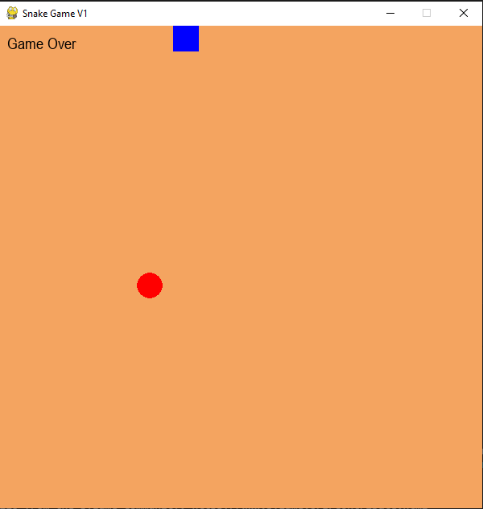
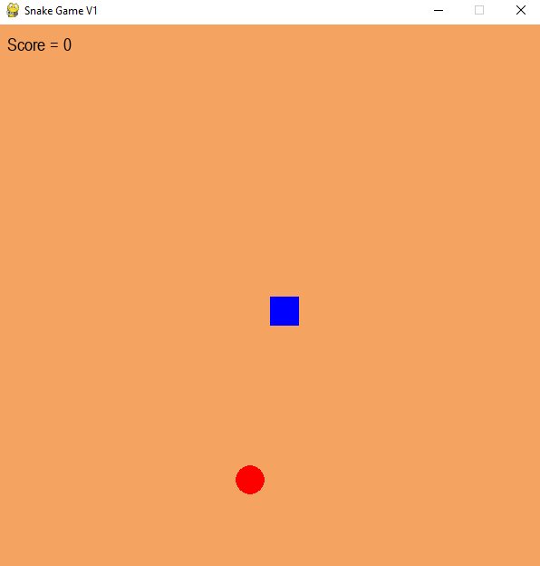

# 🎮 Simple Game with Pygame  






This project is a **simple game** built with **Python (v3.7.9)** and **Pygame (v2.1.2)**.  
It is the **first version (v1.0)** of the game.  

---

## ✨ Features
- 🚀 Developed with **Python 3.7.9 + Pygame 2.1.2**
- 🧩 Very simple and lightweight
- 🛠 Focused on practicing **Object-Oriented Programming (OOP)**
- 🎨 No graphics (basic version only for learning purposes)

---

## 🎯 Purpose
The main goal of this project is to practice and improve understanding of **OOP concepts** in Python.  
In the future, there may be more advanced versions of this game, possibly enhanced with **Artificial Intelligence (AI)**. 🤖  

---

## 📌 How to Run
1. Install dependencies:
   ```bash
   pip install pygame==2.1.2

2. Run the game:
    ```bash
    python main.py

## 📅 Project Status

Current version: v1.0 (Simple OOP Version)

Future versions: May include better graphics and AI-based features

## 👨‍💻 Author

This project is created by **Sajjad Saljoghi** ❤️
