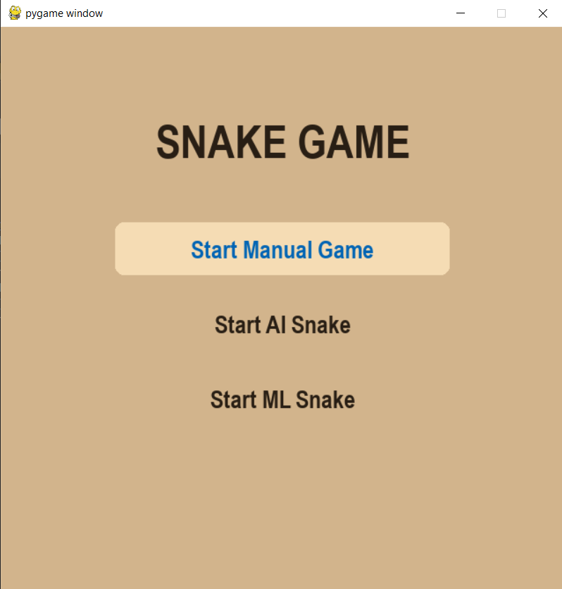
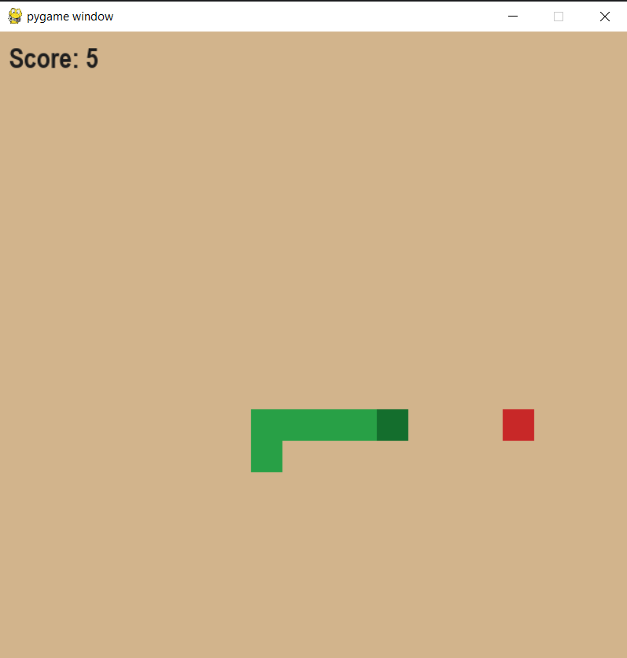
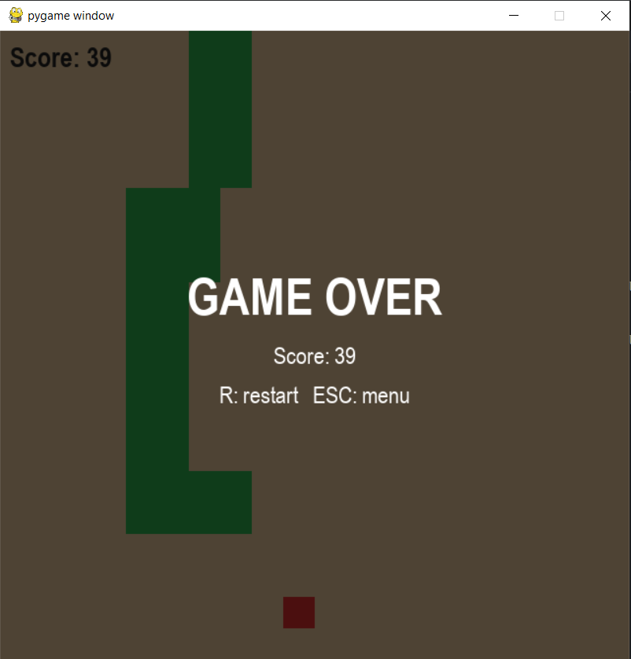
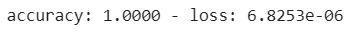
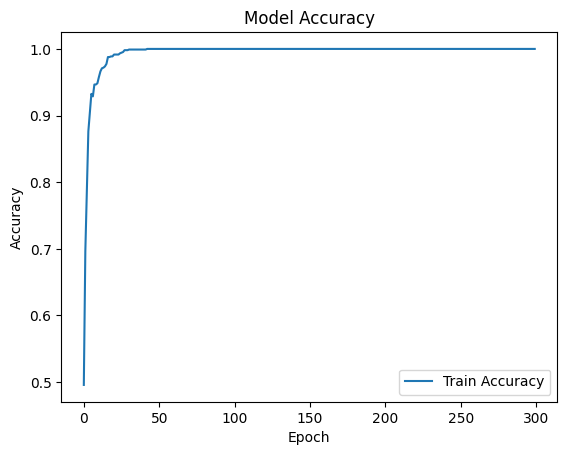
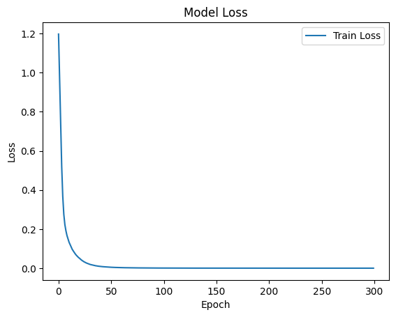
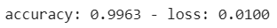

# 🐍 Snake: Manual, Rule-Based AI & Machine Learning

A classic Snake game built with **Python** and **Pygame**, with three ways to play:

| Mode | Who controls the snake? |
|------|-------------------------|
| **Manual** | You, with the arrow keys |
| **AI Snake** | A hand-written rule-based agent that heads for the fruit and avoids danger |
| **ML Snake** | A small **neural network (TensorFlow/Keras)** trained on data recorded from the rule-based AI |

The project doubles as a compact, end-to-end machine learning example: **generate data → train a model → plug it back into the game.**

---

## ✨ Features

- 🎮 Playable Snake with a checkerboard grid, score counter, and Game Over overlay
- 🧭 Menu with keyboard **and** mouse navigation
- 🤖 Rule-based AI that moves toward the fruit and picks a safe direction
- 📊 Automatic dataset generation: every AI move is logged as a (features → direction) sample
- 🧠 Neural network that learns to imitate the AI and plays on its own
- 🔁 Instant restart and return to menu from any game

---

## 🖼️ Preview




---

## 🚀 Getting Started

### Prerequisites

- Python 3.9+ (a version supported by your TensorFlow install)
- `pip`

### Installation

```bash
# 1. Clone the repository
git clone https://github.com/sajjadsaljoughi/Snake-Game.git
cd Snake-Game

# 2. (Recommended) create a virtual environment
python -m venv .venv
source .venv/bin/activate        # Windows: .venv\Scripts\activate

# 3. Install dependencies
pip install -r requirements.txt
```

### Run the game

```bash
python main.py
```

---

## 🕹️ Controls

| Key | Action |
|-----|--------|
| `↑` `↓` | Navigate the menu |
| `Enter` / Left click | Select a mode |
| `← ↑ ↓ →` | Steer the snake (Manual mode) |
| `R` | Restart the current game |
| `Esc` | Back to the menu |

---

## 🧠 How the ML Mode Works

### 1. Features

For every move, the game extracts **6 simple features** (`features.py`):

| # | Feature | Values |
|---|---------|--------|
| 0 | Fruit direction on the X axis (relative to head) | `-1`, `0`, `1` |
| 1 | Fruit direction on the Y axis (relative to head) | `-1`, `0`, `1` |
| 2–5 | Danger flag for moving **Right / Down / Left / Up** | `0` = safe, `1` = blocked |

### 2. Dataset

Playing in **AI mode** records each decision of the rule-based agent (`generate_dataset.py`) and appends it to `dataset.csv` when a run ends. The label is the chosen direction: `r`, `d`, `l`, or `u`.

The included `dataset.csv` contains roughly **1,300 samples**.

### 3. Model

Trained in `train.ipynb` (originally on Google Colab):

```
Input (6 features)
   │
Dense(32, ReLU)
   │
Dense(16, ReLU)
   │
Dense(4, Softmax)  →  Right | Down | Left | Up
```

- **Loss:** sparse categorical cross-entropy
- **Optimizer:** Adam
- **Epochs:** 300
- **Split:** 80% train / 20% test
- **Test accuracy:** ≈ **99.6%** on the held-out split

Train:
<br>

<br>


<br>
Test:
<br>

<br>


The trained model is saved as `sajjad_saljoughi_snake_ml.h5` and loaded by `snake_ml.py` at runtime.

### 4. Retrain it yourself

1. Play a few rounds in **AI mode** to grow `dataset.csv`.
2. Open `train.ipynb` and update the dataset and save paths.
3. Run all cells, then replace `sajjad_saljoughi_snake_ml.h5` with your new model.
4. Launch the game and pick **Start ML Snake**.

---

## 📁 Project Structure

```
.
├── main.py                # Entry point, main loop and state (menu / game)
├── menu.py                # Main menu UI
├── game.py                # Game logic, rendering, mode handling
├── snake.py               # Snake movement, collisions, safety checks
├── fruit.py               # Fruit spawning on free cells
├── setting.py             # Constants (grid size, colors, speed, directions)
├── snake_ai.py            # Rule-based AI agent
├── features.py            # Feature extraction shared by dataset + ML
├── generate_dataset.py    # Records AI decisions as training samples
├── snake_ml.py            # Loads the trained model and predicts moves
├── train.ipynb            # Model training notebook
├── dataset.csv            # Generated training data
├── sajjad_saljoughi_snake_ml.h5   # Trained Keras model
└── requirements.txt
```

---

## ⚙️ Configuration

Tweak the game in `setting.py`:

| Constant | Default | Description |
|----------|---------|-------------|
| `GRID_SIZE` | `20` | Cells per side of the board |
| `CELL_SIZE` | `32` | Pixel size of each cell |
| `MOVE_INTERVAL_MS` | `150` | Time between moves (lower = faster) |

> If you change `GRID_SIZE` or `CELL_SIZE`, also update the window size in `main.py` (`Main(640, 640)`) so it equals `GRID_SIZE × CELL_SIZE`.

---

## 🛠️ Built With

- [Python](https://www.python.org/)
- [Pygame](https://www.pygame.org/)
- [TensorFlow / Keras](https://www.tensorflow.org/)
- [NumPy](https://numpy.org/) & [Pandas](https://pandas.pydata.org/)
- [scikit-learn](https://scikit-learn.org/) (train/test split)

---

## 💡 Ideas for Improvement

- Add features such as distance to walls or the snake's current direction
- Train with reinforcement learning (e.g., DQN) instead of imitation learning
- Add a high-score table and adjustable speed in the menu
- Make the ML mode smarter at avoiding trapping itself as the snake grows

---

## 🤝 Contributing

Contributions, issues, and feature requests are welcome. Feel free to open an issue or submit a pull request.

## 📄 License

Distributed under the MIT License. Add a `LICENSE` file to the repository to make this official.

## 👤 Author

**Sajjad Saljoughi**
GitHub: [@sajjadsaljoughi](https://github.com/sajjadsaljoughi)

---

⭐ If you enjoyed this project, consider giving it a star!
